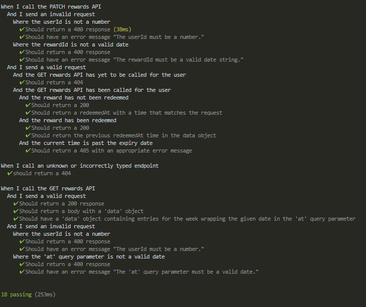

# code-challenge-rewards
A nodeJS based code challenge project

This project comes preset for vscode, the included ```.vscode/launch.json``` allows for running of the app with breakpoints as well as running of mocha tests with breakpoints. 

The api is accessible at ```https://codechallengerewards.jim.wales```

## Code uses a template 

```
https://github.com/Reesy/ts-express-tdd-template
```


## Tests are green (just for convenience)



## Commands:

Install: (requires node and npm)
``` npm install ```

Build: 
``` npm run build ```

Start:
``` npm run start ```

Test:
``` npm run test ```

Any tests added to the test folder will automatically be tested. 

